  

<h1 align="center">🌌 Gemini AI Companion</h1>

<i>A next-generation AI orchestration layer for Minecraft, powered by Google Gemini 3.</i>

  
  
  
  

  <a href="#-getting-started">Getting Started</a> •
  <a href="#-features">Features</a> •
  <a href="#-commands">Commands</a> •
  <a href="#-technical-report-architecture--implementation">How it Works</a>

  

<h2 align="center">🎬 See It In Action</h2>

  
   
  <i>▲ Real-time command execution and natural language reasoning</i>

  

<h2 align="center">✨ Features</h2>

<table align="center">
<tr>
<td align="center" width="33%">🗣️ <b>Natural Language</b> Human-like interaction</td>
<td align="center" width="33%">🧠 <b>Multi-Mode AI</b> Ask, Plan, or Command</td>
<td align="center" width="33%">🔄 <b>Self-Healing</b> 10-step auto-retry</td>
</tr>
<tr>
<td align="center" width="33%">🌠<b>Web Search</b> Google Search Grounding</td>
<td align="center" width="33%">↩️ <b>Undo Engine</b> Revert AI mutations</td>
<td align="center" width="33%">💾 <b>History</b> JSON/TXT Export support</td>
</tr>
</table>

  

<h2 align="center">🚀 Getting Started</h2>

### 🛠️ Prerequisites
*   **Minecraft:** 1.21.1
*   **Loader:** Fabric 0.16.0+
*   **API:** [Gemini API Key](https://aistudio.google.com/apikey) (Free Tier supported)

### 📥 Installation
1.  Drop the jar into your `mods` folder.
2.  Set your key via `/chatkey <YOUR_KEY>`.
3.  Type `/chat` to begin the future.

  

<h2 align="center">💬 Core Commands</h2>

| Command             | Why use it?                                             |
| :------------------ | :------------------------------------------------------ |
| `/chat <msg>`       | The main gateway to the AI.                             |
| `/chat undo`        | Safety net for when AI goes "too far".                  |
| `/chat smarter`     | Escalates logic to the **Pro** model for complex tasks. |
| `/chat skill <...>` | Injects world context (inventory, entities, stats).     |

<h2 align="center">🛣️ Project Roadmap</h2>

- [x] **Core Integration:** Async Gemini 3 API Connection
- [x] **Self-Healing:** Recursive error correction loop
- [x] **Context Awareness:** Inventory & Entity skill injection
- [ ] **Vision Support:** Image analysis for world snapshots (Planned)
- [ ] **Voice Control:** Dictation-based command execution (Backlog)

  

<h2 align="center">📚 Technical Report: Architecture & Implementation</h2>

This section documents the engineering techniques that enable seamless AI-to-game collaboration.

### System Architecture

### Request Lifecycle

### Self-Healing Command Retry

The mod implements an intelligent retry mechanism that feeds command errors back to Gemini:

**Example Retry Flow:**
1. AI generates: `/give @p diamond_sword{Enchantments:[{id:sharpness,lvl:5}]}`
2. Server rejects: "Unknown argument: Enchantments" (1.21.1 uses components)
3. Error fed back to Gemini with context
4. AI corrects: `/give @p diamond_sword[enchantments={levels:{sharpness:5}}]`
5. Command succeeds

### Context Window Management

| Component           | Strategy                                             |
| ------------------- | ---------------------------------------------------- |
| **System Prompt**   | Static instructions for Minecraft command generation |
| **Player Context**  | Dynamically injected: inventory, position, stats     |
| **Chat History**    | Rolling window of last 10 exchanges, FIFO eviction   |
| **Response Buffer** | Reserved tokens to prevent truncation                |

### Thread Safety Model

### Undo System Architecture

```mermaid
stateDiagram-v2
    [*] --> Idle
    Idle --> Executing: /chat command
    Executing --> Recording: Command succeeds
    Recording --> Idle: Push to undo stack
    Idle --> Reverting: /chat undo
    Reverting --> Idle: Execute inverse commands
    
    note right of Recording
        Captures:
        - Entity spawns → /kill
        - Item gives → /clear
        - Effects → /effect clear
    end note
```

---

**Made with ❤️ for the Minecraft community**

[⬆ Back to Top](#-gemini-ai-companion)

