```mermaid
sequenceDiagram
    participant P as Player
    participant M as Mod
    participant R as Game Registry
    participant T as Thread Pool
    participant G as Gemini API
    participant W as Minecraft World

    P->>M: 🎙️ Voice: "Where is the fortress?"
    M->>T: Async Transcribe
    T->>G: POST /audio (Base64)
    G-->>T: "locate fortress"
    T-->>M: Cleaned Transcript
    
    loop Recursive Reasoning
        M->>R: Fetch context
        M->>T: Request Action
        T->>G: POST /chat
        G-->>T: /locate fortress
        T->>M: Command sequence
        M->>W: execute /locate
        W-->>M: "Fortress at 100, 64, -200"
        M->>M: 🔄 Self-Reprompt with Output
    end
    
    M->>W: execute /tp 100 64 -200
    M->>P: "Found it! Teleporting you now."
```

<div align="center">


# 🌌 Gemini AI Companion
### *The Next-Generation Orchestration Layer for Minecraft*

[](https://www.minecraft.net/)
[](https://fabricmc.net/)
[](https://deepmind.google/technologies/gemini/)
[](https://github.com/aaronaalmendarez/gemini-minecraft/releases/tag/v1.0.0)
[](LICENSE)

[**Quick Start**](#-getting-started) • [**Features**](#-pillars-of-intelligence) • [**Roadmap**](#-roadmap) • [**Commands**](#-command-terminal) • [**Technical Specs**](#-the-nerd-stack)

---

### *“The first AI that doesn't just talk to you—it lives in your world.”*


</div>

## ⚡ Quick Try

1.  **Download** the latest release: [**v1.0.0 JAR**](https://github.com/aaronaalmendarez/gemini-minecraft/releases/tag/v1.0.0)
2.  Drop the `.jar` into your **`mods`** folder.
3.  Launch with **Fabric 1.21.1**.
4.  **Experience the Power**:
    *   🎙️ **Hold `V`** and speak naturally (Push-to-Talk).
    *   💬 Type `/chat <your message>` in game.

> *“Build me a small house”*  
> *“Find the nearest village”*

---

## 🎯 Who Is This For?

This project is ideal for:
- **Minecraft Modders**: Experimenting with AI-driven gameplay and orchestration.
- **AI Developers**: Interested in seeing autonomous agents operate within complex sandbox environments.
- **Server Owners**: Looking to add next-level, immersive NPC intelligence to their worlds.
- **Players**: Who want a truly unique, voice-controlled, and narrative-driven Minecraft experience.

---

## 💎 Pillars of Intelligence

Gemini AI Companion isn't just a chatbot. It's a suite of integrated systems that give the AI true digital agency.

### 🎙️ Sensory Intelligence
*The AI perceives your environment in real-time.*
- **Real-Time Voice Transcription**: Issue complex commands via voice audio—transcribed and executed instantly.
- **Structure Awareness**: The AI knows if you’re pillaging a **Bastion**, trading in a **Village**, or exploring an **Ancient City**.
- **Environmental Synchronization**: Deep awareness of server time, weather, dimensions, and nearby entities.

### 🧠 Cognitive Core
*Advanced reasoning that solves complex problems.*
- **Recursive Reasoning**: The AI can reprompt itself to chain multiple steps (e.g., `/locate` → `/tp` → `/give` resources for that biome).
- **Self-Healing Logic**: If a command fails, the AI analyzes the error, updates its logic, and retries automatically (up to 10 stages).
- **Multi-Model Support**: Switch between **Flash**, **Flash-Thinking**, and **Pro** models based on the complexity of your task.

### 🛠️ Modpack Master
*Universal compatibility for the modern player.*
- **Recipe Mastery**: Instantly retrieve complex crafting and smelting paths for **any** item (Vanilla or Modded).
- **Registry Scanner**: Automatically discovers items, blocks, and entity types from your entire modpack via RegistryHints.
- **Undo Engine**: Every AI-driven world mutation can be reverted instantly if it doesn't meet your vision.

### 📊 Pro Ecosystem
*Information at your fingertips.*
- **Real-Time Sidebar**: Track mode, state, token usage, and retries via a sleek in-game scoreboard.
- **Death Historian**: Remembers your last 20 deaths to provide precise survival strategies.
- **History Export**: Download your entire session as `.txt` or `.json` for a permanent record of your AI journey.

---

## ✨ Practical Magic: Real-World Scenarios

Stop thinking of it as a "chatbot." Start thinking of it as your **Second Pilot**.

#### 🎙️ Scenario A: The Voice Architect
> **You (Voice):** "I need a small oak starter house right here, and give me some torches."
>
> **Gemini:** *Analyzes location* → Executes `/fill` for the foundation → `/setblock` for walls/roof → `/give @p torch 16` → "Construction complete, and I've provided lighting for your safety."

#### 🧠 Scenario B: The Recursive Scout
> **You:** "I'm lost. Find me a village, take me there, and set my spawn."
>
> **Gemini:** Executes `/locate structure village` → Parses coordinates → Executes `/tp` → Executes `/spawnpoint` → "Welcome to the village. Your spawn is secured."

<details>
<summary><b>Scenario C: The Self-Healing Engineer</b></summary>

> **You:** "Give me a sword with level 10 Sharpness."
>
> **Gemini:** *Attempts old NBT syntax* → **Minecraft returns error** → **Gemini analyzes error** → *Realizes 1.21.1 uses Components* → Re-issues command using `[minecraft:enchantments={levels:{'minecraft:sharpness':10}}]` → **Success.**

</details>

#### 🛠️ Scenario D: Modpack Mastery
> **You:** "How do I make a Digital Miner from Mekanism?"
>
> > [!IMPORTANT]
> > **CRYSTAL-SCAN IN PROGRESS...**
> > ```text
> > [Registry] Found: mekanism:digital_miner
> > [Logic] Deep-scanning RecipeHints...
> > [Mapping] 12 recursive sub-components identified.
> > ```
> > **Gemini:** "To build the Digital Miner, you'll need a **Robit**, **2 Atomic Alloys**, and a **Teleportation Core**. Since you're missing the Alloys, I've calculated the raw Obsidian and Diamond dust required to smelt them now."

---

---

## 🖼️ Visual Exhibit

<details>
<summary><b>View Interface Screenshots</b></summary>

<div align="center">
<br>

### *“Rainbow Thinking” Feedback Interface*
The mod provides real-time, cinematic feedback via an animated action bar.


</div>
</details>

---

## 🚀 Getting Started

### 1. Prerequisites
- **Java 21** & **Fabric Loader** (1.21.1)
- A **Google Gemini API Key** ([Get one here](https://aistudio.google.com/))

### 2. Physical Installation
1. Drop the `.jar` into your `mods` folder.
2. Launch the game.

### 3. Connection
Connect your key securely using the in-game terminal:
```bash
/chatkey <your-api-key>
```
> [!TIP]
> Use `/chatkey default <key>` to set a server-wide key for all players.

---

## 🎙️ Voice Control

Gemini AI Companion features a built-in **Push-to-Talk** system for true hands-free interaction.

1. **Press & Hold `V`**: The high-end recording overlay will appear at the top of your screen.
2. **Speak Naturally**: "Build me a small oak house" or "Where is the nearest village?"
3. **Release to Execute**: The mod will instantly transcribe your audio and pass it to the Cognitive Core for processing.

> [!NOTE]
> You can rebind the Push-to-Talk key in the standard Minecraft Controls menu.

---

## 📟 Command Terminal

| Command          | Description                                                        |
| :--------------- | :----------------------------------------------------------------- |
| `/chat <prompt>` | Start a conversation or world-management task.                     |
| `/chat undo`     | **Rollback** the last set of AI-executed commands.                 |
| `/chat smarter`  | Force the AI to re-evaluate the last prompt using a **Pro** model. |
| `/chat clear`    | Wipe current session history for a fresh start.                    |
| `/chat history`  | Browse previous exchanges in an interactive menu.                  |
| `/chat config`   | Deep-dive into debug mode, sidebar toggles, and retry limits.      |

---

## 🛠️ The Nerd Stack

The Gemini AI Companion is built on an asynchronous, multi-threaded architecture designed for safety and speed.

<details>
<summary><b>📐 System Architecture</b> (Mermaid Diagram)</summary>


</details>

<details>
<summary><b>🔄 Request Lifecycle</b> (Sequence Diagram)</summary>


</details>

<details>
<summary><b>↩️ Undo System Architecture</b></summary>


</details>

<details>
<summary><b>🛡️ Self-Healing Retry Loop</b></summary>

The AI uses a recursive validation loop to ensure commands actually work in your specific world state.

| Stage              | Action          | Logic                                                            |
| :----------------- | :-------------- | :--------------------------------------------------------------- |
| **1. Parse**       | JSON Validation | Ensures the AI returned a valid command array.                   |
| **2. Dry-Run**     | Syntax Check    | Validates command strings against the Brigadier dispatcher.      |
| **3. Execution**   | World Apply     | Attempts to run the command on the server thread.                |
| **4. Feedback**    | Error Capture   | If it fails, the *exact* Minecraft error is sent back to Gemini. |
| **5. Recalibrate** | Self-Correction | AI re-writes the command to fix the reported syntax/logic error. |
| **6. Repeat**      | Recurse         | The loop continues until success or the 10-retry safety limit.   |

</details>

<details>
<summary><b>🛡️ Thread Safety & Data Flow</b></summary>

The mod maintains strict separation between the **Netty Work Pool** (Networking) and the **Main Server Thread** (World Ticking). All AI responses are sanitized and validated against Minecraft's Brigadier system before execution.

- **Main Thread**: World Mutation, Registry Access, Recipe Lookups.
- **Async Workers**: API calls, JSON Parsing, Transcript Cleaning.
- **Netty**: Packet handling (C2S/S2C).
</details>

---

## 🗺️ Roadmap

The journey to true digital agency is just beginning. Here is where we're headed:

- [ ] **Multiplayer-Aware Memory**: Shared AI context that recognizes different players and their unique histories.
- [ ] **AI Vision (Screenshots)**: Allow the AI to "see" what you see via automated frame analysis.
- [ ] **Voice Synthesis (TTS)**: The AI talks back to you with custom, high-quality personality profiles.
- [ ] **Plugin API**: A framework for creators to write custom behaviors/skills for the AI.
- [ ] **Cross-Loader Support**: Bringing the companion to NeoForge/Forge.

---

## 🤝 Contributing

Contributions are what make the open-source community an amazing place to learn, inspire, and create. Any contributions you make are **greatly appreciated**.

1. Fork the Project
2. Create your Feature Branch (`git checkout -b feature/AmazingFeature`)
3. Commit your Changes (`git commit -m 'Add some AmazingFeature'`)
4. Push to the Branch (`git push origin feature/AmazingFeature`)
5. Open a Pull Request

> [!NOTE]
> Please open an issue first for major changes to ensure alignment with the project's vision.

---

<div align="center">

### *Elevate your Minecraft experience today.*

[**Download for Fabric**](https://fabricmc.net/) | [**Report a Bug**](https://github.com/aaronaalmendarez/gemini-minecraft/issues)

---

### *Built with ❤️ for the Minecraft Community*

</div>
